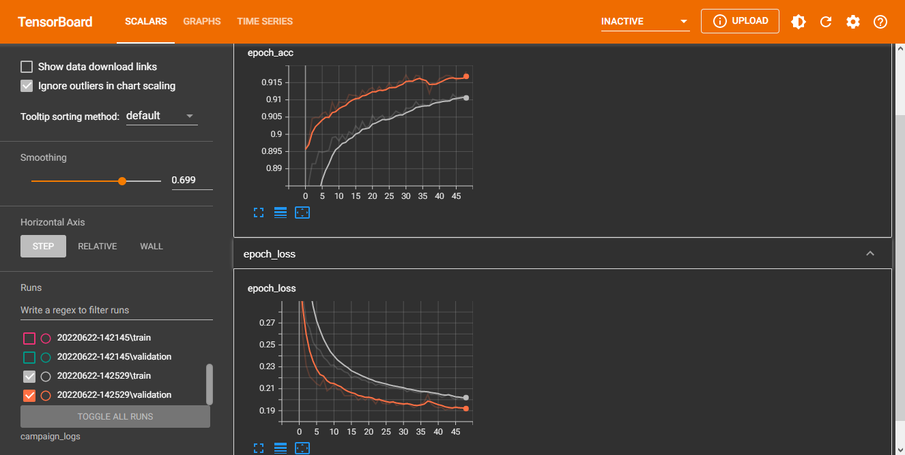

# Customer Campaign Segmentation
The objective of the model is to predict the customers' segmentation base of some features.

## Results

The model scores an astounding accuracy of 92%, it is neither overfitting nor underfitting.

TensorBoard was used to visualise the results. Here is the epochs graph.

## Model architecture

The model used to train this data consists of two hidden layers, excluding input and output.
Each hidden layers contains 64 nodes, after each layer it goes through batch normalization and dropout value of 20%.

# Credits

The data is downloaded from
[Kaggle](https://www.kaggle.com/datasets/kunalgupta2616/hackerearth-customer-segmentation-hackathon)

